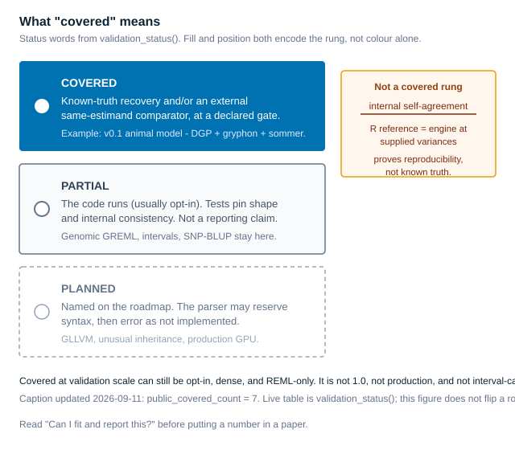

# Progression and evidence

This is an evidence history, not a release timeline. `HSquared.jl` currently
has an experimental **0.9.0 candidate**; the R-public `public_covered_count`
is **7**. Neither fact means production readiness, Julia General registration,
calibrated intervals, or a public release. For applied work, begin in
[hsquared](https://itchyshin.github.io/hsquared/).

## Where we are now

Read the [live validation table](validation-status.md) for route-specific
scope. A Julia engine row can be covered while its R formula, payload mapping,
or public workflow remains planned or partial. The [twin boundary](twin-boundary.md)
explains that distinction before an applied claim is made.

Point estimates may be reported only inside the stated route scope. Intervals
and standard errors do not have a shared coverage guarantee: inspect each
route's claim boundary rather than borrowing evidence from a neighbour.

## How a route earns its label

```@raw html
<figure class="hs-figure">

<figcaption>A label is route-specific evidence, not a general production badge. The generated live table is the source of truth.</figcaption>
</figure>
```

A route moves from **planned** to **partial** when a bounded implementation and
its limits are recorded. **Covered** is a stronger, scoped evidence label: it
does not widen the route, make it default, or settle interval calibration. The
[validation table](validation-status.md) gives the current evidence and the
[audience/comparator page](audience-comparators.md) explains why comparison
must match the estimand.

## Historical milestones, each with a boundary

- **0.1 contract — June 2026 foundation.** Pedigree normalization and sparse
  `Ainv` were established as engine utilities, while the narrow R formula
  contract still stopped honestly at the bridge boundary. This is the starting
  contract, not a production fitting claim; see the
  [0.1 contract](https://github.com/itchyshin/HSquared.jl/blob/main/docs/design/01-v0.1-contract.md)
  and its [pedigree/Ainv record](https://github.com/itchyshin/HSquared.jl/blob/main/docs/dev-log/after-task/2026-06-13-phase-1a-pedigree-ainv.md).
- **Early 0.2–0.4 development — June–July 2026.** Two-effect,
  arbitrary-N independent-effect, k=2 random-regression, and direct–maternal
  work each earned separate, bounded evidence. These are development
  milestones rather than asserted release tags; none transfers its evidence to
  another model or to production scale. See the
  [two-effect record](https://github.com/itchyshin/HSquared.jl/blob/main/docs/dev-log/after-task/2026-06-13-two-effect-reml.md),
  [arbitrary-N R-surface record](https://github.com/itchyshin/HSquared.jl/blob/main/docs/dev-log/after-task/2026-07-01-phase2-r-arbitrary-1g.md),
  [k=2 random-regression evidence](https://github.com/itchyshin/HSquared.jl/blob/main/docs/dev-log/recovery-checkpoints/2026-07-01-rr-k2-covered-evidence.md),
  and [direct–maternal record](https://github.com/itchyshin/HSquared.jl/blob/main/docs/dev-log/after-task/2026-07-02-phase4-direct-maternal.md).
- **0.5.0 — later experimental numbering marker.** The project moved its
  experimental numbering from `0.0.1` to `0.5.0` without claiming a production
  engine or Julia General registration. This does not rewrite the separate
  R-package release history, including its verified v0.1.0 GitHub release.
  See the [0.5.0 changelog](changelog.md#0.5.0-experimental).
- **0.6.0 — R-public multivariate milestone.** The R-public count changed from
  5 to 6, while the engine multivariate row was already covered. This is a
  public-surface milestone, not a new engine promotion or universal
  multivariate reporting permission. See the
  [0.6.0 record](changelog.md#0.6.0-experimental;-historical).
- **0.7.0 — genomic GREML milestone.** The R-public count changed from 6 to 7.
  It does not turn every genomic route, interval, or sparse path into a
  covered default. See the [0.7.0 changelog](changelog.md#0.7.0-experimental)
  and the live [genomic rows](validation-status.md).
- **0.8.0 — engine FA and single-step pillars.** The named engine cells are
  deliberately narrow: FA is S4 `t=4`, `K=1`, positive Ledermann slack,
  interior uniqueness, and rotation-invariant `G`/`R`/`ψ`; single-step is
  H-scale `σ²a/σ²e` under ordinary defaults and `G=A₂₂+0.05I`. R
  factor-analytic grammar remains planned and R single-step remains opt-in
  partial. See the
  [0.8.0 changelog](changelog.md#0.8.0-experimental) and
  [current status](validation-status.md).

## What remains separate

Julia registry status, any future Julia-package release decision, interval
calibration, production readiness, and future roadmaps are separate decisions.
This page does not announce a release or change a status row. For technical plans, use the
[roadmap](roadmap.md) and [developer pages](backend-algorithm-roadmap.md);
for an applied reporting decision, return to the
[twin boundary](twin-boundary.md).
